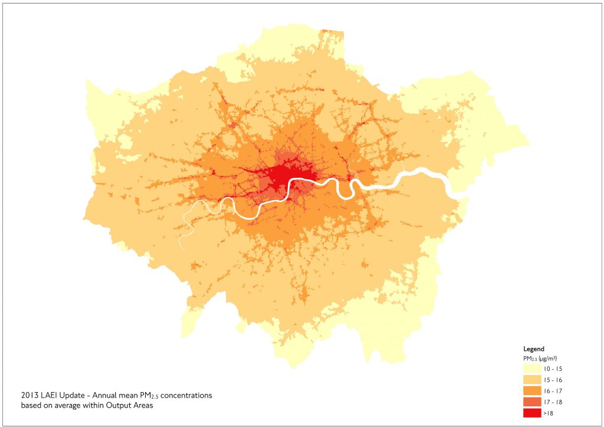
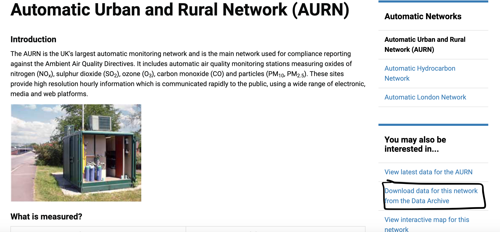
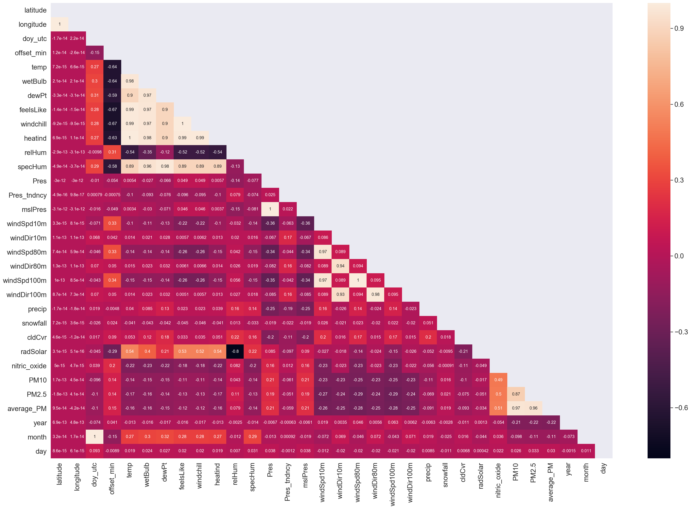
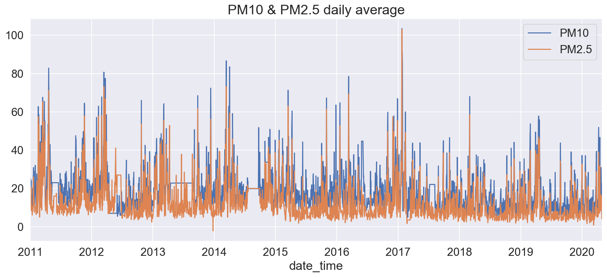
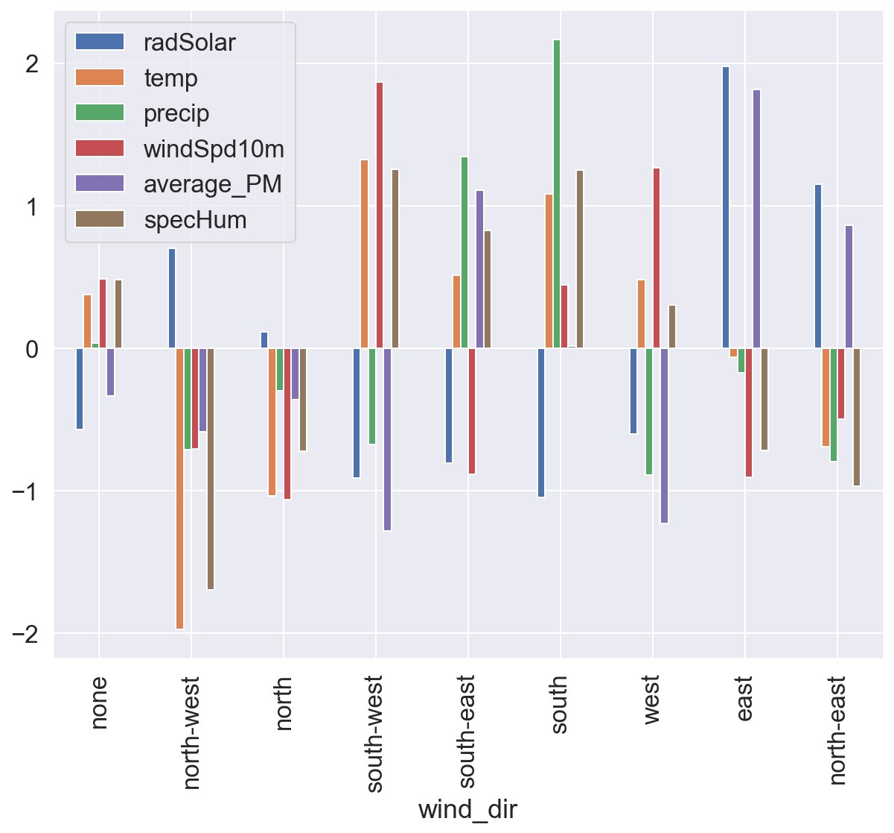
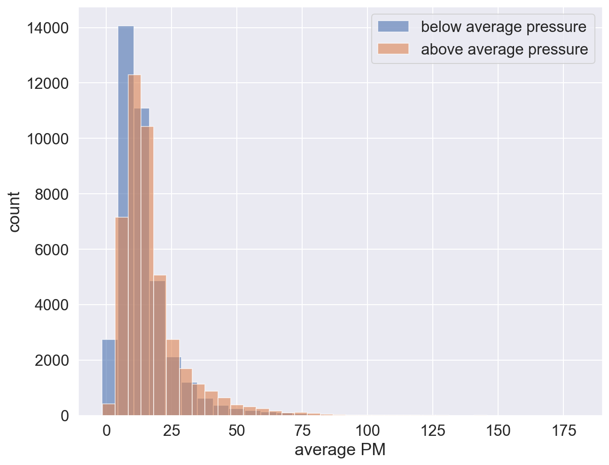
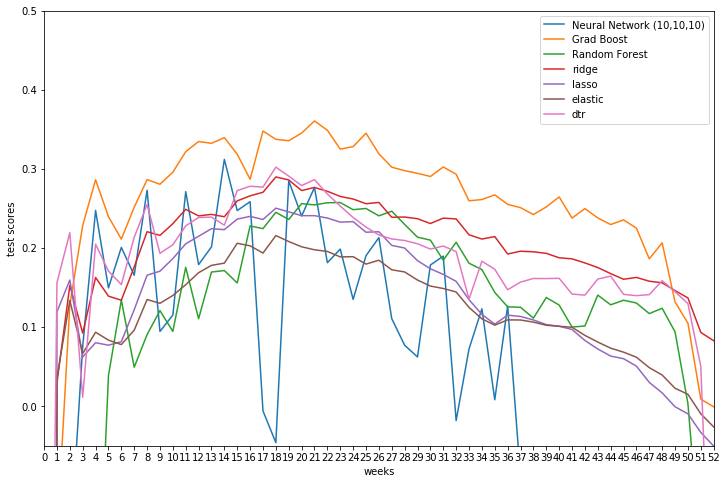
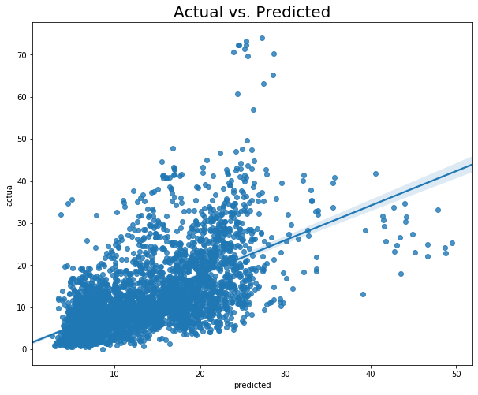

# Predicting London air-pollution by the climate
My 5-week capstone project whilst doing General Assembly's Data Science Immersive bootcamp in London. I used climate data from years 2011 to 2020 to predict PM10 and PM2.5 air particulates concentration in London Kensington. I used various regression models and climate data from WeatherSource and particulate data from uk.gov's AURN archive. The goal of this project was to determine to what effect the climate has an effect on the air pollution (PM10 & PM2.5).

# Table of Contents
- [Predicting London air-pollution by the climate](#predicting-london-air-pollution-by-the-climate)
  * [Motivation](#motivation)
  * [Introduction](#introduction)
  * [The process](#the-process)
    + [Data Acquisition](#data-acquisition)
    + [Data Cleaning](#data-cleaning)
    + [Exploratory Analysis](#exploratory-analysis)
    + [Modelling](#modelling)
    + [Conclusion](#conclusion)
    + [Limitations and Cause for Improvement](#limitations-and-cause-for-improvement)

<small><i><a href='http://ecotrust-canada.github.io/markdown-toc/'>Table of contents generated with markdown-toc</a></i></small>

## Motivation

Air Pollution is a big contributor to the deaths which occur in the UK as per World Health Organisation,  air pollution caused the deaths of 7 million people*[1] in the year 2016, with Africa having the worst effects on it. 
“In the UK it causes 40,000 premature deaths each year”[2].
“29,000 of those are from the particulate matter PM2.5, particulates less than 2.5micrometers.”[2]
While it is a well established fact that fumes from cars and industrial combustion processes are a leading contributor to concentration levels, looking much more deeply at the concentration levels reveals a much more volatile state.
[1]: https://apps.who.int/gho/data/node.sdg.11-6-viz?lang=en
[2]: https://wintoncentre.maths.cam.ac.uk/news/does-air-pollution-kill-40000-people-each-year-uk/

## Introduction
In this project I start by taking particulate matter concentration data PM10, PM2.5 & Nitrogen Oxide (NO) from the Automatic Urban and Rural Network (AURN), the largest automatic monitoring network measuring air pollution.
PM10 & PM2.5 are particulate matters of size 10 micrometers and 2.5 micrometers (thats 10 and 2.5  billionth parts of a meter). I then take climate data credit to WeatherSource for making available the data.

*Null Hypothesis : PM particle fluctuation is controlled by the weather and therefore controlled by nature.*

*Alternative Hypothesis: Change in concentration is due to a sustained and controlled effort to reduce air pollution and also voluntary human activity.*

If the score I obtain for the model is > 0 aka the baseline score, then depending on the magnitude we can induce to which degree the changing weather has an influence on the concentration levels.

## The process
* Data Acquisition
* Cleaning
* Feature Engineering+Merging
* Exploratory Analysis
* Modelling
* Limitations & Cause for improvement.

### Data Acquisition

The data was acquired by visiting uk-air.defra.gov.uk and in the data archive section. There I was able to select what concentration type that I wanted and also the data range that the concentration was going to be for. The measuring point was at London Kensington. Extracting the data was a quick and easy process (also free!). The main drawback to this was that the csv was limited to around 90000x152, this broadly corresponds to about 10 years of **hourly averaged** concentration data. I chose to pick PM10, nitric oxide and PM2.5 concetrations from 01/01/2011 - 12/05/2020.

The next step was acquiring climate data and this was done through WeatherSource's weather-data. Location was London Kengsinton and the date corresponded to 01/01/2011 up until 12/05/2020. The API is charged but luckily they were kind enough to provide this for free to me. 
### Data Cleaning
Examined the air pollution data first and proceeded to change the columns. Then I checked for NaN values. 
|column|null_count|
|------|----------|
|date|0|
|time|0|
|PM10|0|
|PM2.5|0|
|nitric_oxide|0|
|temp|0| 
|wind_speed|0|
|wind_direction|0|

No NaNs so I looked at column datatype and they were all objects. The first 50 entries had a 'No data' as an entry. The whole dataframe had 6000 such entries so I decided to fill these in by propagating the next available value above forward using ffill. First I had to convert cells containing 'No data' into NaN because ffill fills NaN values only. For example applying this to the nitric_oxide column,

df.nitric_oxide.map(lambda x: x if x!='No data' else np.nan),

and then filling this with ffill solved the problem. Then I converted date and time columns into DateTime and TimeDelta formats respectively and an additional column 'date-time' was engineered which is a combination of date and time columns.

Removing NaN values in the climate dataframe was alot simpler as there were NaN values that I found by checking. I simply used ffill to replace them.

[Feature Engineering and Merging](###Feature Engineering and Merging)
I calculated the average concentration just focussing on PM data because I found in the EDA stage that nitric oxide changes quite differently to PM. I converted the temperature columns from farenheit into degrees celcius using a simple function mapping this to all temperature columns. 

I took days of the week out from the date column using .day_of_week() method and mapped this a new column called 'day_of_week'. Then I mapped the month,year and day from the date column and from the month I produced a season column. This was quite simple to implement. If month lies in [12,1,2] return 'Winter' and [3,4,5] return 'Spring' etc. I also extracted wind directions from the wind_Dirc column. I chose 10m above seawater because these air particulates are closer to us so affect us more ultimately than air particulates much further up in the air.

Merging process was a straight forward process. I first sorted the dataframes in ascending order by date-time then I set this as the index. Then I compared all dataframes interms of row count and found that one of them, the climate dataframe, had to be resized down. Both dataframes were then combined using concat inner join on date-time.

### Exploratory Analysis

Heatmap was interesting to see. The wind variables have a negative correlation with concetration and most notably the mean sea level pressure has a positive correlation, around .21.

The decline in measured concentration is very clearly displayed here. As we can see there is a clear trend here.

Easterly winds contributed to higher recorded PM, westerly winds least.

### Modelling
All the models were trained on test data with date ranges ranging as small as a day from the last date to a year away. Gradient Boost achieved the best score of 0.35. This is for a test size of 23 weeks and a Gradient Boosting model with default parameters.

### Conclusion
Score above zero means that there is insufficient evidence to reject the null hypothesis. This means that the climate has an effect on PM10 and PM2.5 concentrations. 

I suspect that trend and random noise affect the models' ability to predict concentration over a large period of time. This due to the sharp decline in R2 for different times. Some models did overfit quite significantly than others like Ada Boost and also test sizes larger than a year also did contribute to overfitted models.
### Limitations and Cause for Improvement
* I did not use gridsearch at all because even while producing the results above the computer took some hours to run, this is something I will do in the immediate future.  
* Use AWS and do hyperparameter tuning on Gradient Boost model.
* Forcast concentration data for up to 28 days.
